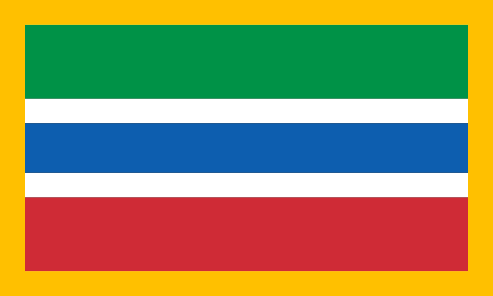
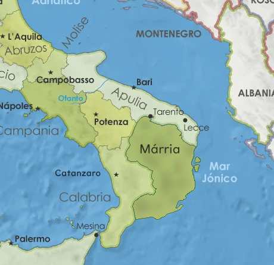

# Mingalés - Conlang

Es un idioma construido / ficticio o conlang. Su historia está situada en la zona sur de Italia, relacionada con Grecia, Montenegro y regiones italianas.  

**Bandera de Marria**

**Por ahora** utiliza el sistema de escritura alfabetica además de fonemas conocidos para ser historicamente acertivo con las lenguas en contacto.

**SE ACEPTA CONTRIBUCIÓN** con:
- **Vocabulario:** origen fonético, pronunciación, variaciones.
- **Correcciones:** desarrollo del cambio y porqué.
- **Gramática:** utilidad, que casos cubre.
- **Mejora:** qué, porqué.
- **Particulas:** origen, uso, reglas. 

## Inspiración y motivación

Es un proyecto simple de una lengüa inspirada por el idioma japonés, su método de conjugar verbos y uso de particulas que marcan aspectos de la oración.  
  
El uso de fonémas parecidos a los del italiano hace a esta lengua fácil de aprender para los hablantes de lenguas romances como el portugués, español, francés y demás.  
  
La motivación de este proyecto es poner en practica mis conocimientos acerca de idiomas sin ser lingüista como un juego o experimento. Ver los errores que voy cometiendo a medida que aprendo e ir modificando el idioma _sobre la marcha_.  
  
## Sonidos

| Escritura                 | Fonema             | Referencia                     |
| :------------------------ | :----------------- | :----------------------------- |
| a, e, o, i, u             | a, e, i, o, u      | *                              |
| ä, ë, ö, ï, ü             | a:, e:, o:, i:, u: | aa, ee, oo, ii, uu             |
| b, s, d, f, l, m, n, p, t | *                  | *                              |
| j, J                      | dʒ                 | "gg"                           |
| c, C                      | tʃ                 | Fonema medio. ref. "techo"     |
| c, C                      | k                  | Fonema inicial. ref. "casa""   |
| q, Q                      | k                  | "taco"                         |
| g, G                      | g                  | "gato"                         |
| y, Y                      | j                  | "yasumi" (japonés. "Descanso") |
| x, X                      | ʔt͡ɕ                | "maccha" (japonés. "Té verde") |
| r, R                      | ɾ                  | "mareo"                        |

## Historia

El archivo con la [historia](texto/historia_marria.txt) narra el origen del idioma en base al contexto de la región.

## Geografía

Márria es una región ficticia entre Apulia y Calabria, Italia.

**Mapa político de Márria**

## Sistema de escritura

Pronto...